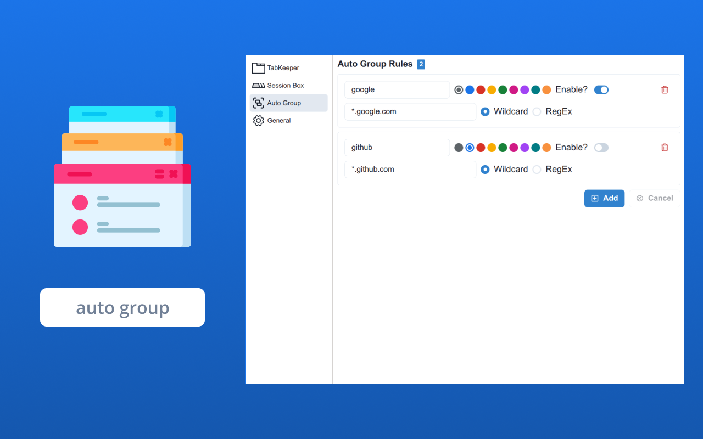
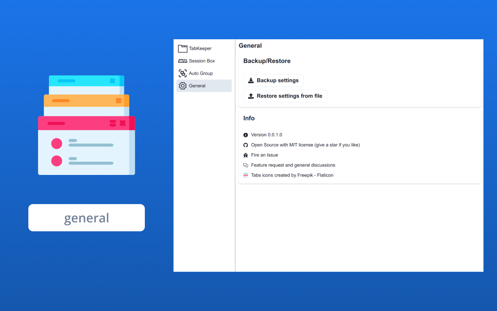

## tabkeeper-extension

Tabkeeper is a chrome/edge extension that helps you manage your tabs and tab groups.

|             tab management              |               session box               |               auto group                |                 general                 |
| :-------------------------------------: | :-------------------------------------: | :-------------------------------------: | :-------------------------------------: |
|  |  |  |  |

Features:

-   Tabs and tab groups management
-   Save your tabs to session box and restore them later
-   Setup auto group rules that will group your tabs automatically

TODO

-   [ ] drag and drop for reordering/moving tabs
-   [ ] window operations: close, activate, minimize, etc.
-   [ ] performance optimization by debouncing
-   [ ] i18n

## Development

This project is created by command `pnpm create vite tabkeeper-extension`
with options `React` and `TypeScript`.

-   `pnpm install` to install dependencies
-   `pnpm dev` to start development server
-   Open <chrome://extensions> in chrome
-   Enable developer mode in chrome extension
-   Click `Load unpacked` and select `dist` folder

## License

[MIT](./LICENSE)

Logo fetched from [Tabs icons created by Freepik - Flaticon](https://www.flaticon.com/free-icons/tabs)
