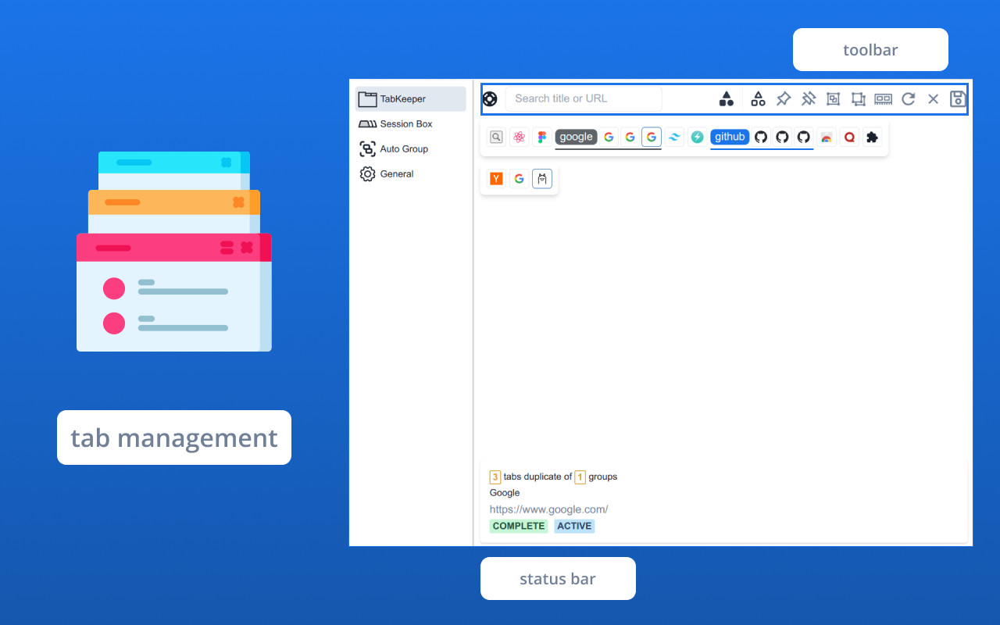
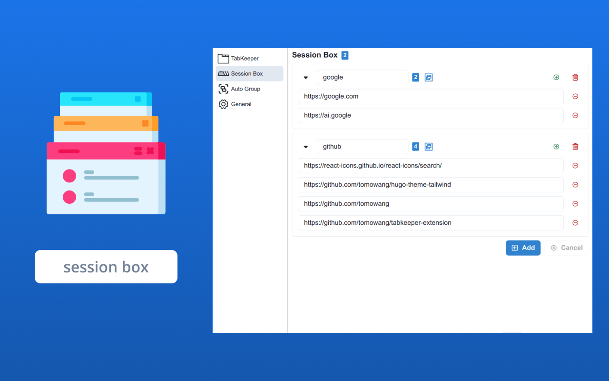
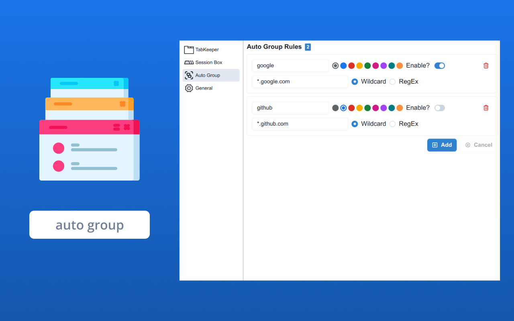
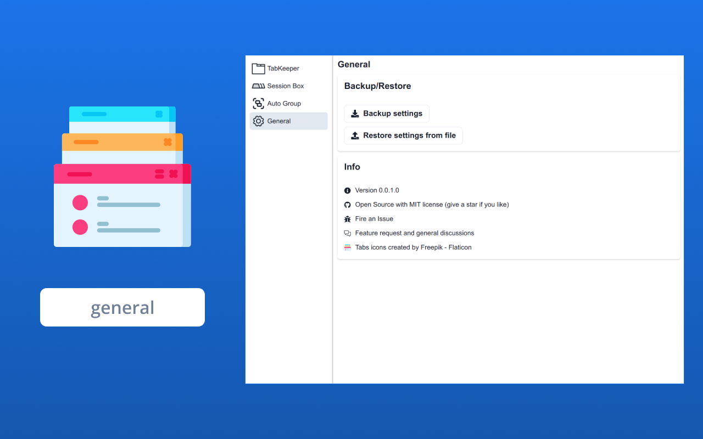
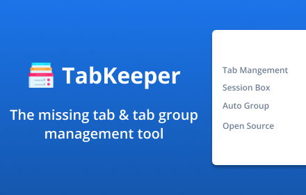

# Store listing

## Title

TabKeeper - Manages Tabs and Tab Groups

## Summary from package

TabKeeper is a browser extension that helps you manage your tabs and tab groups

## Description

TabKeeper is a browser extension that helps you manage your tabs and tab groups.

Create by tomowang with ❤️ <https://tomo.dev>

Features:

-   Tabs and tab groups management
-   Save your tabs to session box and restore them later
-   Setup auto group rules that will group your tabs automatically
-   Free and open source - <https://github.com/tomowang/tabkeeper-extension>
-   Tabs icons created by Freepik - Flaticon <https://www.flaticon.com/free-icons/tabs>

## Category

Tools

## Language

English

## Store icon

## Screenshots

## Small promo tile

## Marquee promo tile

# Privacy

## Single purpose

Manages Tabs and Tab Groups

## Permission justification

-   Storage permission is required to store session box items and auto group rules
-   Tab permission is required to show and management tabs
-   TabGroups permission is required to show and management tab groups

## Data usage

None
